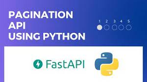

# alx-backend 📟
> *  How to do pagination in Python?
`Send an initial request and return the response — this is used so we can retrieve the total number of pages before paginating.` Run the pagination function — using the number of pages from the previous call and passing in the parameters.
> * `This module helps dividing large lists of items into pages`. The user is shown one page at a time and can navigate to other pages. Imagine you are offering a company phonebook and let the user search the entries.
---

---
## Resources 🔽
> * [REST API DESIGN: Pagination](https://intranet.alxswe.com/rltoken/7Kdzi9CH1LdSfNQ4RaJUQw)
> * [HATEOAS](https://intranet.alxswe.com/rltoken/7Kdzi9CH1LdSfNQ4RaJUQw)
---
## Learning Objectives
> * How to paginate a dataset with simple page and page_size parameters
> * How to paginate a dataset with hypermedia metadata
> * How to paginate in a deletion-resilient manner
